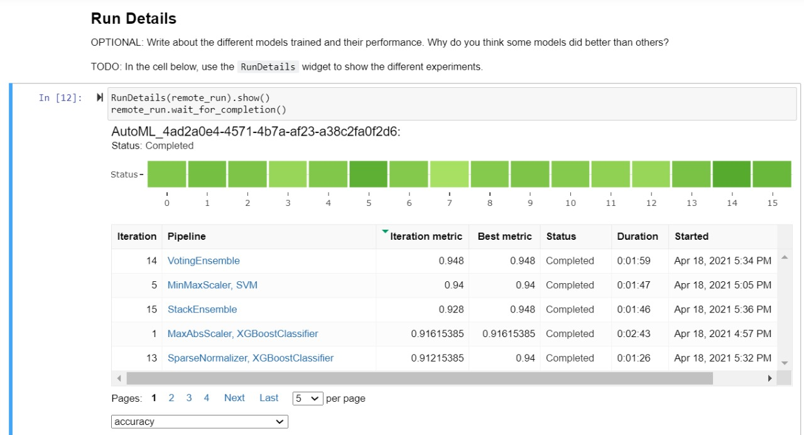
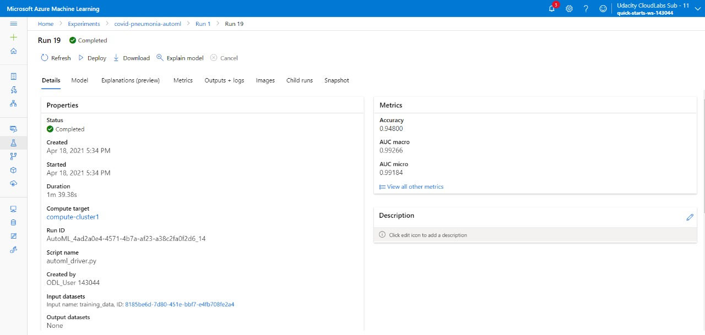
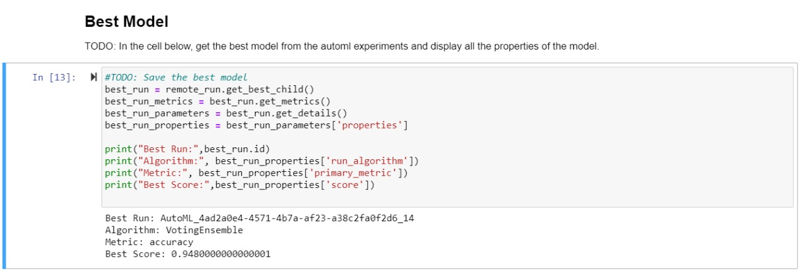
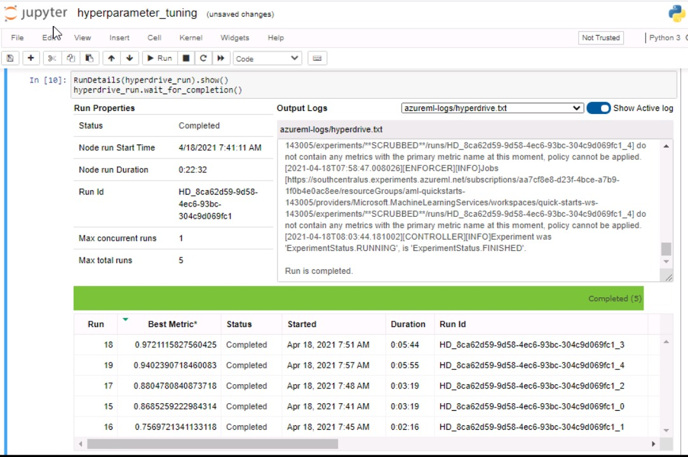
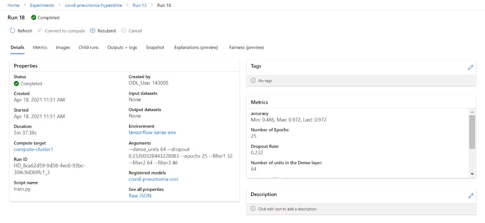

# Covid-19 and Pneumonia Classifier using Chest X-Rays

The aim of this project is to classify Chest X-Ray images as whether they are positive for Covid-19, Viral Pneumonia or Normal (free of both diseases). Two types of classification was implemented using Microsoft Azure ML as follows:
 1. The first is to train a Convolutional Neural Network (CNN) on the dataset and use the HyperDrive feature of AzureML to find the optimal number of filters for each Conv2D layer of the model.
 2. The second option was to use the AutoML feature of AzureML with DNN enabled to automatically train multiple classifier models on the data

## Project Set Up and Installation
The only setup required for the project is to download the [Dataset from Kaggle](https://www.kaggle.com/pranavraikokte/covid19-image-dataset), and extract it to the Project directory so as to get a directory structure as discussed in the Dataset->Access section below.
For demo purposes, a sample dataset with 5 images each for training and testing is attached to the Github repo. The full dataset needs to be downloaded from Kaggle. 

## Dataset

### Overview
The data used for this project is the [Covid-19 Image Dataset](https://www.kaggle.com/pranavraikokte/covid19-image-dataset) from Kaggle. It is an image dataset with 3 classes for *Covid*, *Viral Pneumonia* and *Normal* chest x-rays. 

### Task
The task we are trying to solve is to classify the Chest X-Rays in the dataset as whether they are affected by *Covid*, *Viral Pneumonia* or not affected by either (*Normal*).

#### Featurization of the data
Some common image processing techniques were used on the images as follows:
 * Resizing to a smaller size image (256x256 for HyperDrive) and (100x130 for AutoML)
 * Converting to color mode *grayscale*
 * Scaling the values to be in the range of 0 and 1 (where 0 corresponds to black, and 1 corresponds to white)

### Access
The dataset downloaded from Kaggle is first uploaded to the project directory. Once uploaded, the directory structure of the data folder inside the project directory is as follows:
 - Covid-and-Pneumonia-XRay-Classification (Main Project Folder)
   - Covid19-dataset
     - train
       - Covid
         ... (image files)
       - Viral Pneumonia
         ... (image files)
       - Normal
         ... (image files)
     - test
       - Covid
         ... (image files)
       - Viral Pneumonia
         ... (image files)
       - Normal
         ... (image files)
   - ... (other .py and .ipynb files)

The data was read from this folder and accessed in two different forms for the Hyperdrive and AutoML:
 1. For the HyperDrive, the image data from the *Covid19-dataset/train* folder was read, processed as discussed in the previous section and used to train the CNN. In addition, the data was also registered as a FileDataset.
 2. For the AutoML, as AzureML's AutoML feature currently does not support FileDatasets, the image data from the *Covid19-dataset/train* folder was read, processed as discussed in the previous section and further converted to a Pandas Dataframe, which was then registered as a TabularDataset. This registered dataset was used to run the AutoML experiment.

## Automated ML
The AutoML settings used for this project is as follows:
*{"enable_dnn":True, "experiment_timeout_minutes":45, "max_cores_per_iteration":3, "featurization":"off"}*
As this project uses an image dataset with a Convolutional Neural Network chosen for the HyperDrive, similar Deep Learning algorithms had to be considered for the AutoML as well. Hence the setting *"enable_dnn":True, "enable_tf":False* were used to enable Deep Learning models in the AutoML.
But at the same time, to restrict the long training time of AutoML, the *experiment_timeout_minutes* was set to 45, and *featurization* was disabled.

### Results
The best AutoML model was a VotingEnsemble model which gave an accuracy of 94.8% on the dataset. It was found that the AutoML experiment took extensively long times to run with DNN enabled which sometimes also exceeded the provided lab environment time, hence the *experiment_timeout_minutes* was set to 45 minutes which restricted the number of models run. This also resulted in only non-DNN models being trained by the AutoML, which is why the best model was from the VotingEnsemble algorithm.

The VotingEnsemble algorithm as the name suggests uses multiple models and uses soft voting to find the overall result. The VotingEnsemble trained by the AutoML uses the following algorithms with equal weights as follows:
 - 'SVM' - (Weightage: 0.166)
 - 'XGBoostClassifier' - (Weightage: 0.166) 
 - 'XGBoostClassifier' - (Weightage: 0.166)
 - 'RandomForest' - (Weightage: 0.166)
 - 'LightGBM' - (Weightage: 0.166)
 - 'XGBoostClassifier' - (Weightage: 0.166)

 Possibly, if the time constraints were not there, in future, the experiment can be made to run for a longer time to also check the performance of Deep Neural Network models trained by the AutoML.

Below is the screenshot of the AutoML RunDetails widget which shows some of the classifiers that were trained.  
  

Below are the screenshots of the Best Model trained by AutoML in the studio, and its parameters and score in the Jupyter Notebook.
 
  

## Hyperparameter Tuning
The model chosen for the HyperDrive experiment is a Convolutional Neural Network(CNN). There were 2 main reasons to chose a CNN for the HyperDrive experiment.
 1. The first reason was to explore how Neural Networks with Tensorflow and Keras can be used within AzureML, as well as to try an image (FileDataset) in AzureML.
 2. Secondly, as we require an image classifier for this project, CNNs are known to be very effective with images compared to other Deep Neural Networks.

The layer structure of the Convolutional Neural Network is as follows:

    Conv2D_1
      MaxPooling2D_1
    Conv2D_2
      MaxPooling2D_2
    Dropout_1
    Conv2D_3
      MaxPooling2D_3
    Dropout_2
    Conv2D_4
      MaxPooling2D_4
    Dropout_3
    Flatten
    Dense_1
    Dense_2

There were 6 hyperparameters of the CNN tuned using the HyperDrive. *RandomParameterSampling* was used with the following parameter ranges as follows:
 * For a CNN, one of the most important hyperparameters are the number of filters used in each of the Conv2D layers. Hence 3 hyperparameters used corresponds to the number of filters in the 4 Conv2D layers.
   * The parameter space for filter1 and filter2 were just made to choose among 3 options 16, 32, 64 (which are the commonly used number of filters for CNNs)
   * To explore other filter sizes rather than the commonly used ones, the parameter space for filter3 was made to be of a higher range of values (range(16,67,10), i.e. (16, 26, 36,..., 66))
 * 4th Hyperparameter corresponds to the number of dense units in the Dense_1 layer, again made to choose from the 3 options 16, 32, 64
 * 5th hyperparameter correponds to the dropout rate for the Dropout layers, which was a continuous variable, hence had to be chosen within the range of 0.2 to 0.5
 * 6th hyperparameter is the number of epochs to train the CNN. It was found that the CNN starts overfitting when it crosses 30 epochs, and hence the parameter range of the epochs were made to be chosen among 5, 10, 15, ..., 25

### Results
The CNN model had an accuracy of approximately 97%, clearly higher than the AutoML model. The hyperparameters chosen by the HyperDrive for the best performing model are as follows:
 - dense_units - 64
 - dropout - 0.23200328443228083
 - epochs - 25
 - filter1 - 32
 - filter2 - 64
 - filter3 - 46

The model already seems to be performing quite well with good enough accuracy and doesn't require any improvements to be made.

Following is the screenshot of the Run Details widget output for the Hyperdrive experiment.
  

Below is the screenshot from the ML Studio, for the Best Model tuned and trained by Hyperdrive. The parameters used can be seen in the Arguments section under Properties.
  

## Model Deployment
The CNN model was the best performimg model and hence was deployed as an ACI Webservice with Authentication enables. To query the endpoint, a sample image from the *test* subdirectory of the *Covid19-Dataset* folder was read using the *keras.preprocessing.image* methods like *load_img* and *img_to_array* which converts the image to a NumPy array. This converted image was then sent to the Endpoint using the Python *requests* library.
As Authentication is enabled, first the authentication keys of the endpoint are retrieved using *service.keys()* which are then used in the HTTP header to send a POST request to the REST Endoint generated. The demo of the same can be seen in the screencast linked in the next section

## Screen Recording
Below is the link to the screencast of the project, which first shows the trained and deployed HyperDrive model, followed by a quick overview of the AutoML model.
https://youtu.be/bqi5CBMkqww
